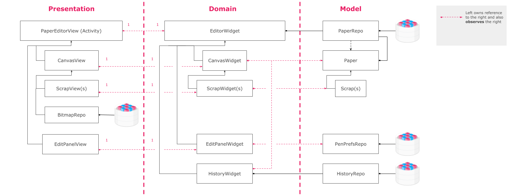

Paper - A Handwriting Note
===

A handwriting note created by engineers who believe software could make our life better.

Editor Architecture Overview
---

We follow the principle of clean architecture, where there are three modules, [app-model](app-model/src/main/java/com/paper/model), [app-domain](app-model/src/main/java/com/paper/domain), and [app-presentation](app-model/src/main/java/com/paper). The relationship between them is described as below:

Original doc [link](https://docs.google.com/drawings/d/1HjgjYfOgQ7Feqqww7I1kuq9HtHsbIhSdXItr31JMVyU/edit?usp=sharing)