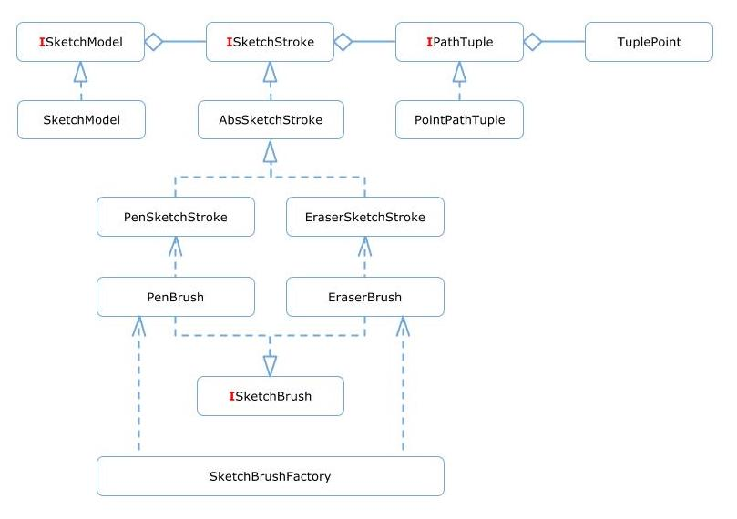
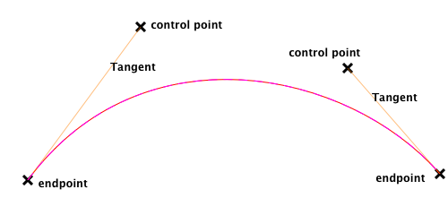
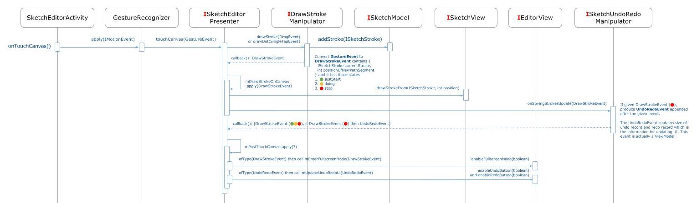
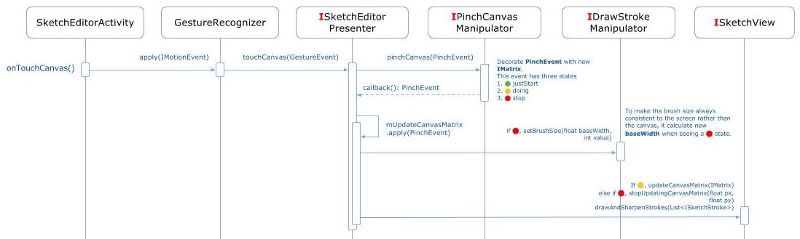

Library - Sketch Editor
===

Usage
---

Given a `SketchModel` struct and an background image (optional), you could draw/erase pen stroke and export the result as `SketchModel` struct.

For Example:

```java
startActivityForResult(
    new Intent(this, SketchEditorActivity.class)
        // Pass a sketch struct.
        .putExtra(SketchEditorActivity.PARAMS_SKETCH_STRUCT, sketchModel)
        // Pass a sketch background.
        .putExtra(SketchEditorActivity.PARAMS_BACKGROUND_FILE, background)
        // Remembering brush color and stroke width.
        .putExtra(SketchEditorActivity.PARAMS_REMEMBERING_BRUSH_COLOR, brushColor)
        .putExtra(SketchEditorActivity.PARAMS_REMEMBERING_BRUSH_SIZE, brushSize)
        // Alert message.
        .putExtra(SketchEditorActivity.PARAMS_ALERT_TITLE_MESSAGE, getString(R.string.doodle_clear_title))
        .putExtra(SketchEditorActivity.PARAMS_ALERT_CONFIRM_MESSAGE, getString(R.string.doodle_clear_message))
        .putExtra(SketchEditorActivity.PARAMS_ALERT_POSITIVE_MESSAGE, getString(R.string.doodle_clear_ok))
        .putExtra(SketchEditorActivity.PARAMS_ALERT_NEGATIVE_MESSAGE, getString(R.string.doodle_clear_cancel))
        // Ask the editor enter fullscreen mode.
        .putExtra(SketchEditorActivity.PARAMS_FULLSCREEN_MODE, true)
        // DEBUG mode.
        .putExtra(SketchEditorActivity.PARAMS_DEBUG_MODE, true),
    REQUEST_CODE);
```

Essentially, we use MVP and observable in this project.

Contract
---

The [SketchContract](src/main/java/com/cardinalblue/lib/doodle/protocol/SketchContract.java) describes the communication between model, view and presenter.

Model
---

The model contains all properties for making a sketch. There's no business logic here. 

### Class Diagram


[[doc]](https://docs.google.com/a/cardinalblue.com/drawings/d/1KL_EVm_c-dMBjsVg-QAQVRAxkfFSf7obD2A6Ppv78eU/edit?usp=sharing)

The sketch model. A sketch contains stroke(s), [ISketchStroke](src/main/java/com/cardinalblue/lib/doodle/protocol/ISketchStroke.java). Each stroke contains tuple(s), [IPathTuple](src/main/java/com/cardinalblue/lib/doodle/protocol/IPathTuple.java). A tuple represents a node of a path segment and contains at least one point and up to **THREE** points, [TuplePoint](src/main/java/com/cardinalblue/lib/doodle/data/TuplePoint.java). These points are endpoints or control-points for describing a bezier curve.

### Bezier Curve



View
---

[SketchView](src/main/java/com/cardinalblue/lib/doodle/view/SketchView.java)

constructing...

Presenter
---

The [ISketchEditorPresenter](src/main/java/com/cardinalblue/lib/doodle/controller/SketchEditorPresenter.java) is the only presenter and it's responsible for wiring the observables and observers together.

constructing...

### Class Diagram

### Events

For some of the UI events (e.g. [GestureEvent](src/main/java/com/cardinalblue/lib/doodle/event/GestureEvent.java)) and most of the ViewModel events (e.g. [UndoRedoEvent](src/main/java/com/cardinalblue/lib/doodle/event/UndoRedoEvent.java)), they have `justStart` , `doing`  and `stop`  states. The business logic determines what to do next by telling the states and the UI also reacts these states.

### Sequence Diagram - Draw Strokes

[[doc]](https://docs.google.com/a/cardinalblue.com/drawings/d/1Y5YjenJWTdmFiwFQHer-zMZw6ADbHbKtfPYRu-kNAvk/edit?usp=sharing)

The [IDrawStrokeManipulator](src/main/java/com/cardinalblue/lib/doodle/controller/DrawStrokeManipulator.java) is responsible for producing strokes and updating strokes to the model, then pass [DrawStrokeEvent](src/main/java/com/cardinalblue/lib/doodle/event/DrawStrokeEvent.java) in the callback to the [ISketchEditorPresenter](src/main/java/com/cardinalblue/lib/doodle/controller/SketchEditorPresenter.java). And then the `ISketchEditorPresenter` dispatch the `DrawStrokeEvent` to the [ISketchView](src/main/java/com/cardinalblue/lib/doodle/view/SketchView.java) and [ISketchUndoRedoManipulator](src/main/java/com/cardinalblue/lib/doodle/controller/SketchUndoRedoManipulator.java). If the `ISketchUndoRedoManipulator` does add record to its data store, it returns [UndoRedoEvent](src/main/java/com/cardinalblue/lib/doodle/event/UndoRedoEvent.java) to the `ISketchEditorPresenter` in order to update the visibility of undo and redo buttons.

constructing...

### Sequence Diagram - Pinch-In/Out The Canvas

[[doc]](https://docs.google.com/a/cardinalblue.com/drawings/d/1kGcxmITnAg1OaYHae29k5h_ANeqc75SBRQJOjrKbP-k/edit?usp=sharing)

constructing...

### Sequence Diagram - Undo/Redo

constructing...

### Sequence Diagram - Back/Cancel/Done

constructing...

Other Business Logics
---

### Flow Diagram - Draw Bezier Curves
constructing...

TODO
---

- Refactoring: Merge `PointF` and `TuplePoint`.
- Refactoring: Abstract the code of drawing strokes to a custom `Drawable`.
